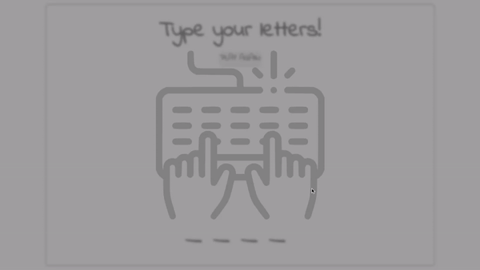

# Hangman

Simple game (I thought) but it was actually quite complicated.

\
[https://hangman-taewoo.netlify.app/](https://hangman-taewoo.netlify.app/)
 
 

## Some of the challenges were:

1. Had to draw the stick man with canvas API
2. Things like "Displaying keyboard input on screen, and remove the rendering 0.8s later"
3. CSS Keyframes to add animations the way I want them to
4. Logic to check if the keyboard input has already been entered before
5. Logic to insert the keyboard input in the corresponding dash (\_ \_ \_ \_)
6. Utilizing guard clauses in the logic above (to try to make it more readable but not sure if it does)
7. Module bundling issues with browserify

Despite the challenges, it was really fun to put some lo-fi music on and solve them.
\
&nbsp;

## What could be improved?

- Using "display: none;" to hide divisions in modals, etc, caused it to be impossible to add fade-out animations.
- Not the cleanest code, but figured that I'd move on and come back later after experiencing more projects.
- Starting animation can get annoying when the user already knows to type the letters on the keyboard.
- If one gets the wrong letter, the container shakes, giving it some feedback. However, when the letter is right, there is no feedback.

&nbsp;
