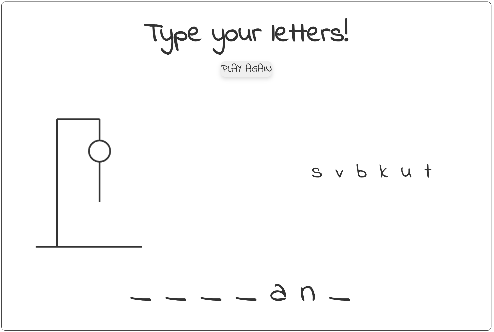

# Hangman

Simple game (I thought) but it was actually quite complicated.
\
\
Some of the challenges were:

1. Had to draw the stick man with canvas API
2. Things like "Displaying keyboard input on screen, and remove the rendering 0.8s later"
3. CSS Keyframes to add animations the way I want them to
4. Logic to check if the keyboard input has already been entered before
5. Utilizing guard clauses in the logic above (to try to make it more readable but not sure if it does)
6. Module bundling issues with browserify so I just copied some code from the npm module

Despite the challenges, it was really fun to put some lo-fi music on and solve them.
\
\
What could be improved?

- Using "display: none;" to hide divisions in modals, etc, caused it to be impossible to add fade out animations.
- Code refactoring, wanted to add the init() function in the JS file to initialize everything but I wanted to move on to other projects.
-

# Preview

